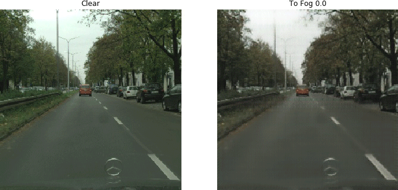

# Foggy-CycleGAN

 

This project is the implementation for my Computer Science MSc thesis in the University of Debrecen.

Dissertation: 
<a href="./dissertation/Simulating%20Weather%20Conditions%20on%20Digital%20Images%20-%20Final.pdf" target="_blank">[PDF] Simulating Weather Conditions on Digital Images</a> (Debrecen, 2020).

## Description
**Foggy-CycleGAN** is a
<a href="https://junyanz.github.io/CycleGAN/" target="_blank">CycleGAN</a> model trained to synthesize fog on clear images. More details in the dissertation above.

## Code
The full source code is available under GPL-3.0 License in my Github repository <a href="https://github.com/ghaiszaher/Foggy-CycleGAN" target="_blank">ghaiszaher/Foggy-CycleGAN</a>

## Pre-trained Models
A version of pre-trained models used in the thesis can be found [here](https://drive.google.com/drive/folders/1QKsiaGkMFvtGcp072IG57MfY1o_D-L3k?usp=sharing).

## Notebook 
A Jupyter Notebook file <a href="https://github.com/ghaiszaher/Foggy-CycleGAN/blob/master/Foggy_CycleGAN.ipynb" target="_blank">Foggy_CycleGAN.ipynb</a> is available in the repository.
 

## Results

 

 

 

 

&copy; Ghais Zaher 2020

