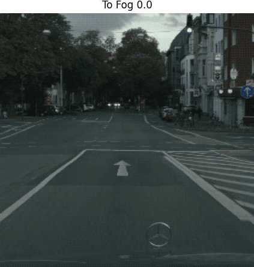

> [!NOTE]  
> November 2024: New Pre-trained Models are available, check the [Pre-trained Models](#pre-trained-models) section.

# Foggy-CycleGAN

 

This project is the implementation for my Computer Science MSc thesis in the University of Debrecen.

Dissertation: 
<a href="./dissertation/Simulating%20Weather%20Conditions%20on%20Digital%20Images%20-%20Final.pdf" target="_blank">[PDF] Simulating Weather Conditions on Digital Images</a> (Debrecen, 2020).

# Table of Content
- [Description](#description)
- [Code](#code)
- [Notebook](#notebook)
- [Results (2020)](#results-2020)
- [Pre-trained Models](#pre-trained-models)
- [Results (2024)](#results-2024)
- [2024-11-17-rev1-000 Test Notebook](#2024-11-17-rev1-000-test-notebook-a-hrefhttpscolabresearchgooglecomgithubghaiszaherfoggy-cycleganblobmaster2024-11-17-rev1-000-testipynb-target_blankimg-srchttpscolabresearchgooglecomassetscolab-badgesvg-altopen-in-colaba)

## Description
**Foggy-CycleGAN** is a
A Jupyter Notebook file <a href="https://github.com/ghaiszaher/Foggy-CycleGAN/blob/master/Foggy_CycleGAN.ipynb" target="_blank">Foggy_CycleGAN.ipynb</a> is available in the repository.

## Code
The full source code is available under GPL-3.0 License in my Github repository <a href="https://github.com/ghaiszaher/Foggy-CycleGAN" target="_blank">ghaiszaher/Foggy-CycleGAN</a>

## Notebook 
A Jupyter Notebook file <a href="./Foggy_CycleGAN.ipynb" target="_blank">Foggy_CycleGAN.ipynb</a> is available in the repository.

## Results (2020)

 

 

 

 

&copy; Ghais Zaher 2020

## Pre-trained Models
As legacy pre-trained models are no longer compatible with newer Keras/Tensorflow versions, I have retrained the model and made the new weights available to download.

Each of the following models was trained in Google Colab using the same dataset, the parameters for building the models and number of trained epochs are a bit different:

<table align="center">
  <thead>
    <tr>
      <th>Model</th>
      <th>Trained Epochs</th>
      <th>Config</th>
    </tr>
  </thead>
  <tbody>
    <tr>
      <td><a href="https://drive.google.com/drive/folders/1QKsiaGkMFvtGcp072IG57MfY1o_D-L3k?usp=sharing">2020-06 (legacy)</a></td>
      <td>145</td>
      <td>
        use_transmission_map=False 
        use_gauss_filter=False 
        use_resize_conv=False
      </td>
    </tr>
    <tr>
      <td><a href="https://drive.google.com/drive/folders/1--W53NNrVxS5pvrf8jDKCRmg4h4vD5lx?usp=sharing">2024-11-17-rev1-000</a></td>
      <td>522</td>
      <td>
        use_transmission_map=False 
        use_gauss_filter=False 
        use_resize_conv=False
      </td>
    </tr>
    <tr>
      <td><a href="https://drive.google.com/drive/folders/1rQ7jmsv63uv6v45IVZmZ8w9CVktqJAfn?usp=sharing">2024-11-17-rev2-110</a></td>
      <td>100</td>
      <td>
        use_transmission_map=True 
        use_gauss_filter=True 
        use_resize_conv=False
      </td>
    </tr>
    <tr>
      <td><a href="https://drive.google.com/drive/folders/1-0-z7KTMXTrwwUdeJtkUOBCWkwD6behO?usp=sharing">2024-11-17-rev3-111</a></td>
      <td>103</td>
      <td>
        use_transmission_map=True 
        use_gauss_filter=True 
        use_resize_conv=True
      </td>
    </tr>
    <tr>
      <td><a href="https://drive.google.com/drive/folders/1hDxJtU0agbnPO2XrrPo26RQJKOePa6WX?usp=sharing">2024-11-17-rev4-001</a></td>
      <td>39</td>
      <td>
        use_transmission_map=False 
        use_gauss_filter=False 
        use_resize_conv=True
      </td>
    </tr>
  </tbody>
</table>

## Results (2024)
The results of the new models are similar to the previous ones, here are some samples:

<table align="center">
  <thead>
    <tr>
      <th>Clear</th>
      <th>2024-11-17-rev1-000</th>
      <th>2024-11-17-rev2-110</th>
      <th>2024-11-17-rev3-111</th>
      <th>2024-11-17-rev4-001</th>
    </tr>
  </thead>
  <tbody>
    <tr>
      <td></td>
      <td></td>
      <td></td>
      <td></td>
      <td></td>
    </tr>
    <tr>
      <td></td>
      <td></td>
      <td></td>
      <td></td>
      <td></td>
    </tr>
    <tr>
      <td></td>
      <td></td>
      <td></td>
      <td></td>
      <td></td>
    </tr>
    <tr>
      <td></td>
      <td></td>
      <td></td>
      <td></td>
      <td></td>
    </tr>
    <tr>
      <td></td>
      <td></td>
      <td></td>
      <td></td>
      <td></td>
    </tr>
  </tbody>
</table>

## 2024-11-17-rev1-000 Test Notebook 
A Jupyter Notebook file <a href="https://github.com/ghaiszaher/Foggy-CycleGAN/blob/master/2024-11-17-rev1-000-test.ipynb" target="_blank">2024-11-17-rev1-000-test.ipynb</a> is available in the repository to test the 2024-11-17-rev1-000 model.
